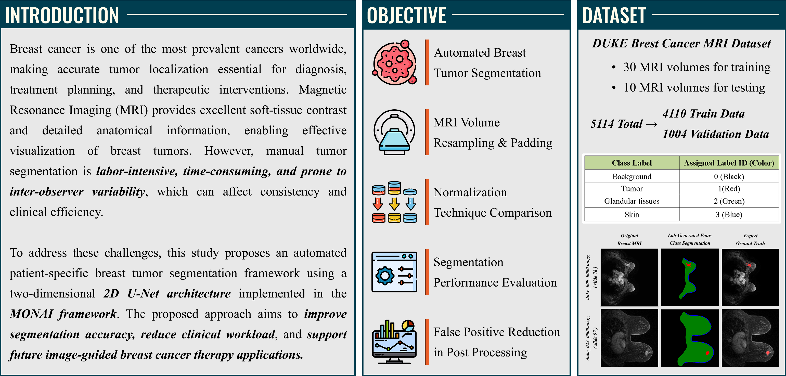
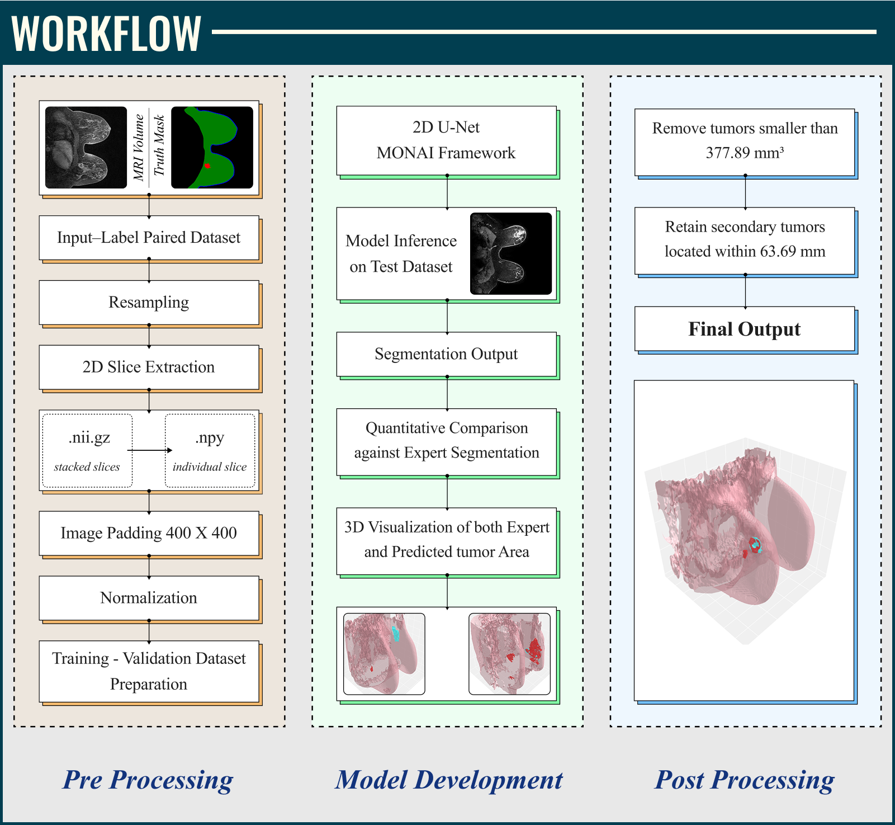

<div align="center">

# Breast Tumor Segmentation Using 2D U-Net and MONAI


</div>

## Introduction


## Workflow


## Final Results


## Overview

This project presents an automated breast tumor segmentation framework using a 2D U-Net architecture implemented with the MONAI (Medical Open Network for AI) framework. The system processes breast MRI scans and generates multi-class segmentation masks containing:

* Background
* Tumor
* Glandular Tissue
* Skin

The primary objective is to provide an efficient and computationally lightweight segmentation pipeline suitable for systems with limited GPU resources while maintaining clinically relevant segmentation performance.

---

## Features

* Automated breast MRI tumor segmentation
* 2D U-Net implementation using MONAI
* NIfTI (.nii/.nii.gz) medical image support
* Voxel spacing standardization through resampling
* Slice-based preprocessing pipeline
* Multi-class segmentation
* Data augmentation support
* Multiple intensity normalization strategies
* Post-processing to reduce false positives
* Quantitative evaluation using standard segmentation metrics

---

## Dataset

The project utilizes the Duke Breast Cancer MRI Dataset derived from the multicenter breast DCE-MRI benchmark dataset.

### Training Dataset

* 30 MRI volumes

### Testing Dataset

* 10 MRI volumes

### Segmentation Classes

| Label ID | Class            |
| -------- | ---------------- |
| 0        | Background       |
| 1        | Tumor            |
| 2        | Glandular Tissue |
| 3        | Skin             |

---

## Project Workflow

### 1. Data Preparation

* Load MRI volumes and corresponding labels
* Pair image-label volumes
* Volume-level train-validation split
* Prevent patient-level data leakage

### 2. Preprocessing

* Voxel spacing resampling
* Axial slice extraction
* Padding to 400 × 400 pixels
* Intensity normalization

### 3. Data Augmentation

* Random rotations
* Random flipping

### 4. Model Training

* MONAI-based 2D U-Net
* Dice Cross-Entropy Loss
* Validation monitoring using Dice Score

### 5. Inference

* Segmentation prediction on unseen MRI volumes

### 6. Post-Processing

* Remove tumor regions smaller than 377.89 mm³
* Remove anatomically isolated tumor regions using centroid-distance analysis

---

## Directory Structure

```text
Automated_Breast_Segmentation/
│
├── Data/
│   ├── Training_data/
│   │   ├── imagesTr/
│   │   └── labelsTr/
│   │
│   ├── Testing_data/
│   │   └── imagesTs/
│   │
│   ├── 2d_slices/
│   └── Predicted_mask/
│
├── Scripts/
│   ├── 2d_slices.py
│   ├── train_2d_unet.py
│   └── inference.py
│
├── best_model.pth
│
└── README.md
```

---

## Intensity Normalization Methods Evaluated

The following normalization approaches were investigated:

1. No Normalization
2. Min-Max Normalization
3. Min-Max Normalization (Background Excluded)
4. Z-Score Normalization

---

## Training Environment

### Software

* Python 3.10
* PyTorch 2.2
* MONAI 1.5
* NumPy
* NiBabel
* SimpleITK
* SciPy
* OpenCV
* Matplotlib
* Pandas
* Scikit-learn

### Hardware

* NVIDIA T1000 GPU
* 4 GB VRAM
* CUDA 11.8

---

## Evaluation Metrics

Model performance is evaluated using:

* Dice Similarity Coefficient (DSC)
* Intersection over Union (IoU)
* Precision
* Recall

---

## Results

Key observations from the study:

* Z-score normalization achieved the highest validation Dice score.
* Min-Max normalization achieved the best independent test Dice score.
* Post-processing effectively reduced false-positive detections.
* The 2D slice-based approach provided a favorable balance between computational efficiency and segmentation accuracy.

---

## Applications

The generated tumor segmentation masks can be used for:

* Breast cancer analysis
* Tumor localization
* Treatment planning
* Medical image research
* Image-guided microwave-based breast cancer therapy systems

---

## Citation

```bibtex
@mastersthesis{jain2026breastsegmentation,
  author       = {K. S. Suraksha Jain},
  title        = {Automation of Patient Specific Breast Cancer Image Segmentation Using 2D U-Net MONAI},
  school       = {Indian Institute of Technology Madras},
  year         = {2026},
  type         = {M.Tech Dissertation}
}
```

---

## Acknowledgements

* Indian Institute of Technology Madras (IIT Madras)
* Prof. Kavitha Arunachalam
* MONAI Development Team
* Duke Breast Cancer MRI Dataset Contributors

---

## License

This project is intended for academic and research purposes only.

Users are responsible for complying with the licensing terms and usage restrictions of the original datasets and associated resources.
